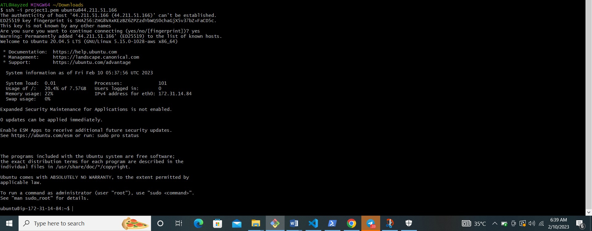
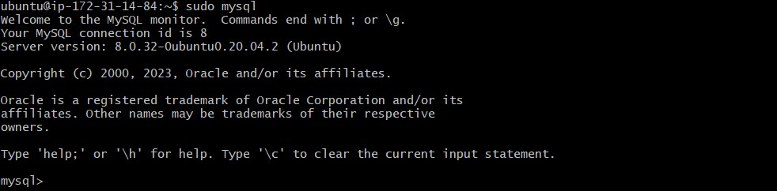

## DOCUMENTATION OF PROJECT 1

i installed the Lamp technology stack (linux, apache, mySQL, PHP or pyhton or perl) through these following steps;

## prepapring prerequisites
1. AWS free tier account
2. github account
3. git bash

### STEP1
## Linux
login to your aws root or IAM account to create an ec2 instance.

1. select ubuntu 20.04
2. generate key pair .pem
3. create security group
4. select desired memory size
5. launch instance

ssh your virtual in your terminal when you are in the downloads folder that has the .pem file    cd~/Downloads

`ssh -i project1.pem ubuntu@your public-IP-address`

### STEP 2
## installing apache2 and updating fire wall

run  `sudo apt update`

`sudo apt install apache2`

To verify that apache2 is running

run `sudo syemctl status apache2`

If it is green and running, then you did everything correctly – you have just launched your first Web Server in the Clouds!
Before we can receive any traffic by our Web Server, we need to open TCP port 80 which is the default port that web browsers use to access web pages on the Internet
As we know, we have TCP port 22 open by default on our EC2 machine to access it via SSH, so we need to add a rule to EC2 configuration to open inbound connection through port 80:

run `curl http://localhost:80`

Open a web browser of your choice and try to access the following url

*http://44.211.51.166:80*

## step 3
installing MYSQL

`sudo apt install mysql-server`

when the installation is finished/ login to mysql console by typing 

`sudo mysql`

set a password for the root user

`ALTER USER 'root'@'localhost' IDENTIFIED WITH mysql_native_password BY 'PassWord.1';`

Exut the MYSQL shell with:

mysql> `exit`

start the interactive script by running:

`sudo mysql_secure_installation`

put in PassWord.1 as the password. Then select y or Y for the question brought up

select 0,1 or 2 as the level of password validation.

press y for yes and enter key for further questions that are being asked.

When you're finished, test if you're able to login to the mysql console by typing:

`sudo mysql -p`

put in your new password

To exit the console:

mysql> `exit`

## step 4

installing PHP

PHP is the component of our setup that will process code to display dynamic content to the end user. In addition to the php package, you’ll need php-mysql, a PHP module that allows PHP to communicate with MySQL-based databases. You’ll also need libapache2-mod-php to enable Apache to handle PHP files. Core PHP packages will automatically be installed as dependencies.
To install these 3 packages at once, run:

 `sudo apt install php libapache2-mod-php php-mysql`

## step 5

# creating a virtual host for your website using apache

create the directory for "project lamp" using 

`sudo mkdir /var/www/projectlamp`

Next assign ownwership of the directory with your current system user:

`sudo chown -R $USER:$USER /var/www/projectlamp`

Then, create and open a new configuration file in Apache’s sites-available directory using your preferred command-line editor:

`sudo vi /etc/apache2/sites-available/projectlamp.conf`

This will create a new blank file. Paste in the following bare-bones configuration by hitting on i on the keyboard to enter the insert mode, and paste the text:

`<VirtualHost *:80>
    ServerName projectlamp
    ServerAlias www.projectlamp 
    ServerAdmin webmaster@localhost
    DocumentRoot /var/www/projectlamp
    ErrorLog ${APACHE_LOG_DIR}/error.log
    CustomLog ${APACHE_LOG_DIR}/access.log combined
</VirtualHost>`

To save and close the file, simply follow the steps below:
1. Hit the esc button on the keyboard
2. Type:
3. Type wq. w for write and q for quit
4. Hit ENTER to save the file

you can now use *a2ensite*command to enable the new virtual host:

`sudo a2ensite projectlamp`

`sudo a2dissite 000-default`

To make sure your configuration file does not contain syntax error, run:

`sudo apache2ctl configtest`

`sudo systemctl reload apache2`

create an index.html file in */var/www/projectlamp* location so we can test that the virtual host works as expected:

`sudo echo 'Hello LAMP from hostname' $(curl -s http://169.254.169.254/latest/meta-data/public-hostname) 'with public IP' $(curl -s http://169.254.169.254/latest/meta-data/public-ipv4) > /var/www/projectlamp/index.html`

Now go to your browser and try to open your website URL using ip address:

*http://your pubic-IP-address:80*

## step 6

# enable PHP on the website

run:

`sudo vim /etc/apache2/mods-enabled/dir.conf`

press i, then paste this:

`<IfModule mod_dir.c>
        #Change this:
        #DirectoryIndex index.html index.cgi index.pl index.php index.xhtml index.htm
        #To this:
        DirectoryIndex index.php index.html index.cgi index.pl index.xhtml index.htm
</IfModule>`

After saving and closing the file, you will need to reload apache so the changes takes effect.

create anew folder named index.php inside your custom web root folder:

`vim /var/www/projectlamp/index.php`

This will open a blank file. Add the following text, which is valid PHP code, inside the file:

`<?php
phpinfo();`

Save and close the file, refresh the page and you will see a page similar to this:

If you can see this page in your browser, then your PHP installation is working as expected.

After checking the relevant information about your PHP server through that page, it’s best to remove the file you created as it contains sensitive information about your PHP environment -and your Ubuntu server. You can use rm to do so:

`sudo rm /var/www/projectlamp/index.php`

